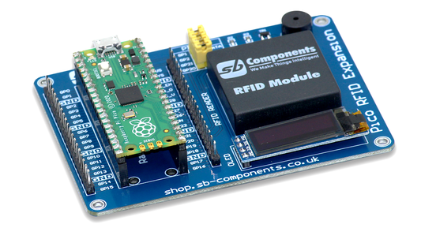

# Raspberry Pi Pico RFID Expansion

Raspberry Pi Pico RFID Expansion is the latest technology in the range of SB Component products boasting an advanced RFID Reader at the frequency of 125KHz with a compact design that has a programmable 0.91” OLED Display and, an updated UART/I2C interface running, that is compatible with Raspberry Pi Pico.

## How to use ?

### Board Details :

| RFID/Oled/Buz Pins |PICO Pins |
| -------------      | -----    |
| RFID DATA          | GP1      |
| Buzzer             | GP2      |
| Oled SDA           | GP20     |
| Oled SCL           | GP21     |

### Requirements

* Raspberry Pi Pico RFID Expansion (Buy it from : https://shop.sb-components.co.uk/products/raspberry-pi-pico-rfid-expansion )
* Raspberry Pi Pico (Buy it from : https://shop.sb-components.co.uk/collections/latest-collections/products/raspberry-pi-pico-board-with-header  )
* USB Cable
* Jumper Cables (optional)

### Steps :

* Connect Raspberry Pi Pico on female header of Pico RFID Expansion.
* Connect USB cable on Raspberry Pi Pico USB port.
* Make sure default jumpers are connected for RFID/Buzzer/Oled (Yellow one).
* Clone/Download Pico RFID Expansion repository.
* Now use example code "Board_test.py" from pico RFID Expansion's github repository.
* Choose interpreter as 'MicroPython (Raspberry Pi pico)'.
* Click on green play button to run example on Pico RFID Expansion.
* Now tap you RFID card/Tag/keyfob on RFID reader to print tag output on Oled Display.

Note: You can use any other GPIO of Raspberry Pi Pico by removing default jumper and connection it to GPIO using jumper cables. 
